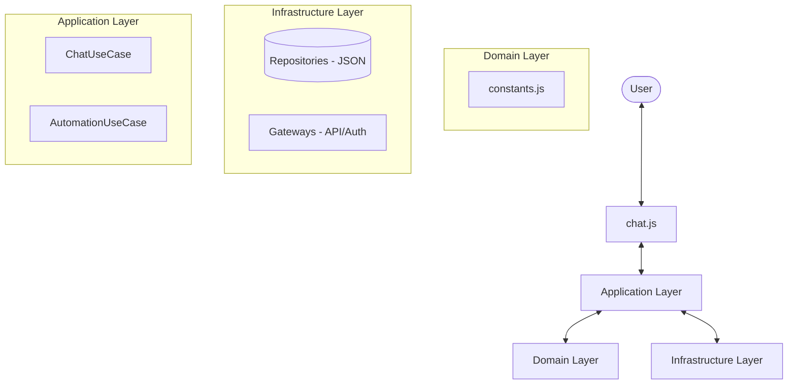

# Codexia - Technical Specification

## 1. Overview
A professional-grade terminal chat interface designed to bridge standard Chat models and the specialized Codex API. It features persistent sessions, declarative automation through YAML templates, and custom protocol handling to ensure multi-turn conversation stability.

## 2. Architecture

O motor segue os princípios da **Clean Architecture**, separando responsabilidades em camadas para garantir testabilidade e manutenibilidade.

### 2.1 Component Diagram

### 2.2 Core Structure
- **Interface**: `chat.js` (CLI e UI).
- **Application**: `src/application/use-cases/` (Lógica de chat e automação).
- **Domain**: `src/domain/constants.js` (Configurações e cores).
- **Infrastructure**:
    - `src/infrastructure/repositories/`: `JsonSessionRepository.js`, `JsonTokenRepository.js`.
    - `src/infrastructure/gateways/`: `AiGateway.js`, `AuthGateway.js`.

## 3. Authentication Flow
The application uses the **Device Code Flow** to authenticate ChatGPT accounts (Free/Plus):
1. User receives a 8-character code and a URL.
2. User authenticates via web browser.
3. CLI polls for a Bearer Token.
4. Tokens are stored locally and automatically refreshed via `refresh_token` when expired (saved to `codex_tokens.json`).

## 4. Hybrid Protocol Handling
The engine dynamically adjusts its request payload based on the selected model family:

### 4.1 Chat Models (e.g., `gpt-5.1`)
- **Input Type**: Simple text string.
- **State Management**: Uses `previous_response_id` (Server-side chaining).
- **Instructions**: Sent via the root `instructions` field.

### 4.2 Codex Models (e.g., `gpt-5.1-codex`)
- **Input Type**: Array of structured message objects (`[{ role, content: [{ type, text }] }]`).
- **State Management**: **Manual History Injection**. The CLI sends the last 40 token-messages in every request.
- **Protocol Requirements**: 
    - `store: false` must be explicit.
    - `instructions` (root) is mandatory for API validation but semantically ignored.
    - **Behavior Control**: Real instructions must be injected as a `system` role message at index 0 of the `input` array.

## 5. Automation Engine (/run)
The `/run` command allows execution of YAML-defined tasks:
- **Schema**: Supports `meta`, `context`, `objective`, `style`, and `quality` metrics.
- **Modes**:
    - **Isolated (Default)**: Executes a stateless prompt, displays results in real-time stream, but does not alter active history.
    - **Injected (`--inject`)**: Merges the automation result into the persistent `conversationHistory` for subsequent turn context.

## 6. Persistence Details
Session state is synced to `codex_session.json` after every AI response:
- `currentModel`: Last used model.
- `lastResponseId`: Server ID for Chat models.
- `conversationHistory`: Local buffer for Codex models.

## 7. Commands Reference
- `/help`: Detailed command list.
- `/model <id>`: Switch model and update persistence.
- `/run <file> [--inject]`: Execute a YAML template.
- `/new`: Hard reset of local history and server-side session.
- `/tokens`: Diagnostic view of authentication status and expiration.
