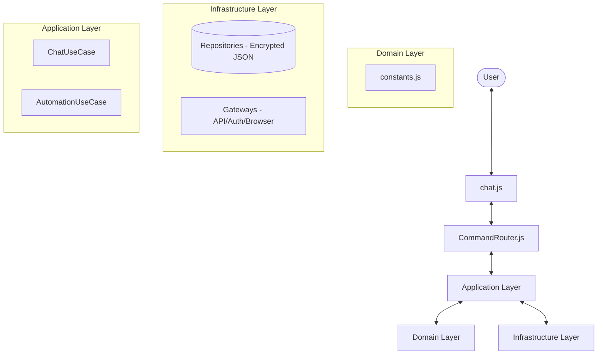

# Codexia - Technical Specification

## 1. Overview
Codexia is a professional-grade **Agentic Engineering Terminal**, designed to bridge standard Chat models and the specialized Codex API. Beyond a simple interface, it features autonomous memory curation, multi-layer security hardening, and stable long-term context management via hybrid protocols and YAML-based automations.

## 2. Architecture

The engine follows **Clean Architecture** principles, maintaining a strict separation between UI/CLI control, application use cases, and infrastructural concerns.

### 2.1 Component Diagram

### 2.2 Core Components
- **Interface/Router**: 
    - `chat.js`: Orchestrates the main loop, multiline input, and real-time streaming.
    - `src/interface/CommandRouter.js`: Central parser and executor for `/commands`.
- **Application**: 
    - `ChatUseCase`: Main engine for turn-based state management, context compression, and system prompt injection.
    - `AutomationUseCase`: Executor for structured YAML tasks.
- **Infrastructure**:
    - **Security Repositories**: Encrypted storage for session tokens (`AES-256-GCM`).
    - **Gateways**: Connectivity to Codex API, Device Auth, and Browser (Playwright).

## 3. Security Hardening

Codexia is the first CLI motor with a "Safe-by-Construction" design for local engineering:

### 3.1 Token Encryption
Tokens are never stored in plain text. They are encrypted using `AES-256-GCM` with a 32-byte secret key (`.codex_secret`). A unique 12-byte IV and 16-byte Auth Tag are stored alongside the payload to ensure integrity.

### 3.2 Workspace Sandboxing
Command operations (`/read`, `/write`) are restricted by default to the local repository workspace.
- **Access Control**: Any access outside the workspace requires the `--force` flag.
- **Audit Logging**: Operations using `--force` are logged as `[AUDIT]` events for transparency.

## 4. Agentic Memory Management

A dedicated **Memory Curator** system maintains long-term project knowledge:

### 4.1 Multi-Layer Context
- **Session Memory**: Active conversation history (Short-term).
- **Memory topics** (`memory/`): Curated technical topic files in Markdown (Long-term).
- **Memory Index** (`MEMORY.md`): Central entry point for all project-specific knowledge.

### 4.2 Autonomous Ops
The AI can autonomously propose new memories or index updates via the `/write` command. 
> [!IMPORTANT]
> **Human-in-the-Loop**: All autonomous write operations require explicit human authorization (y/N) via a reactive terminal prompt.

## 5. Context Collapse (Auto-Compression)

To maintain performance and stability in high-turn sessions, Codexia implements **Context Collapse**:
- **Trigger**: Activates when the conversation history exceeds 40 messages.
- **Action**: The AI summarizes the technical essence of the sequence, purging redundant logs while preserving critical architectural decisions.

## 6. Hybrid Protocol Handling
- **Chat Models**: Server-side chaining via `previous_response_id`.
- **Codex Models**: Manual large-scale history injection.

## 7. Commands Reference
- `/help`: System overview and command list.
- `/model <id>`: Switch model family.
- `/read <path>`: Read file/directory content with sandbox check.
- `/write <path> <content>`: Agentic file persistence (requires auth).
- `/fetch <url>`: Extract clean text from web pages via Playwright.
- `/new`: Hard reset of session and server state.
- `/tokens`: Encrypted token lifecycle diagnostics.
